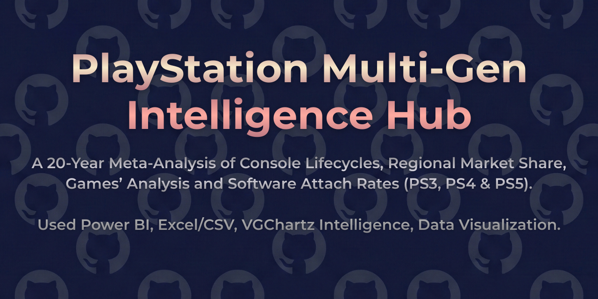
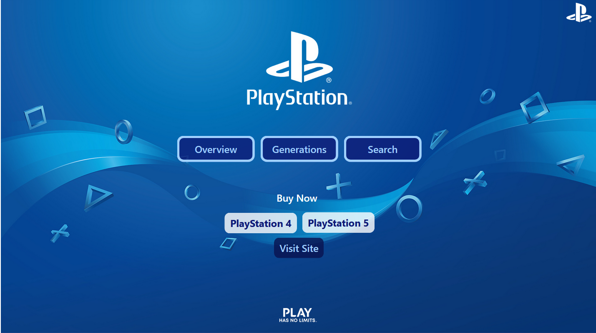
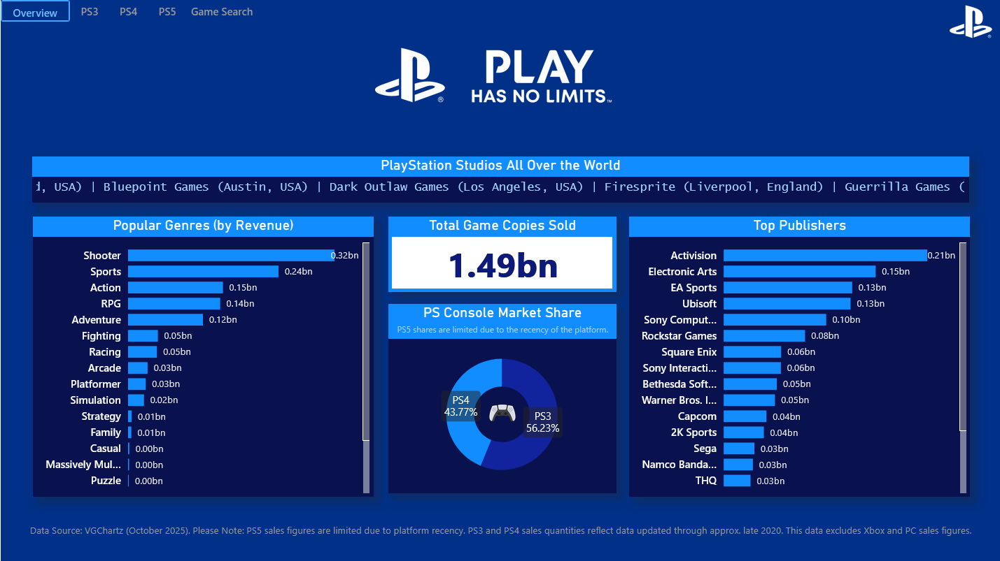
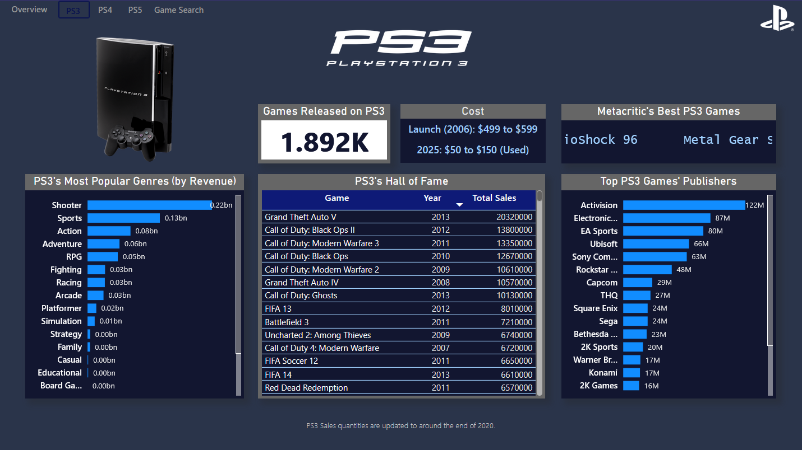
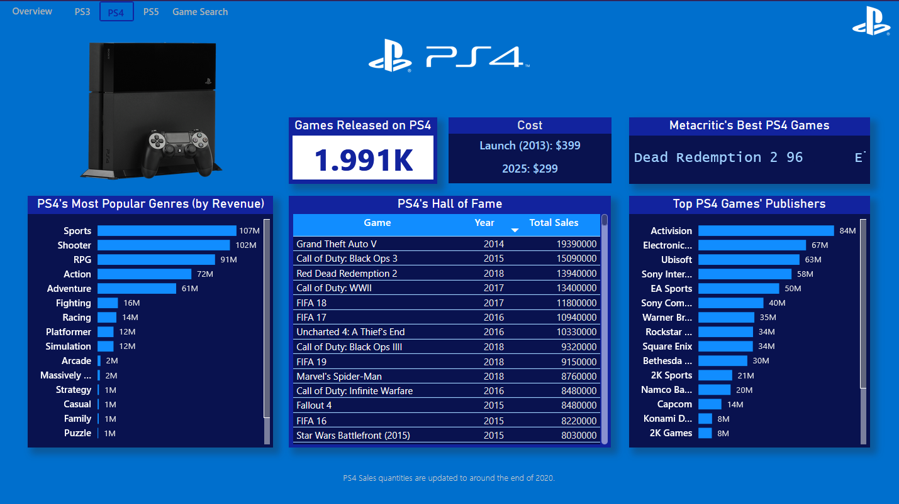
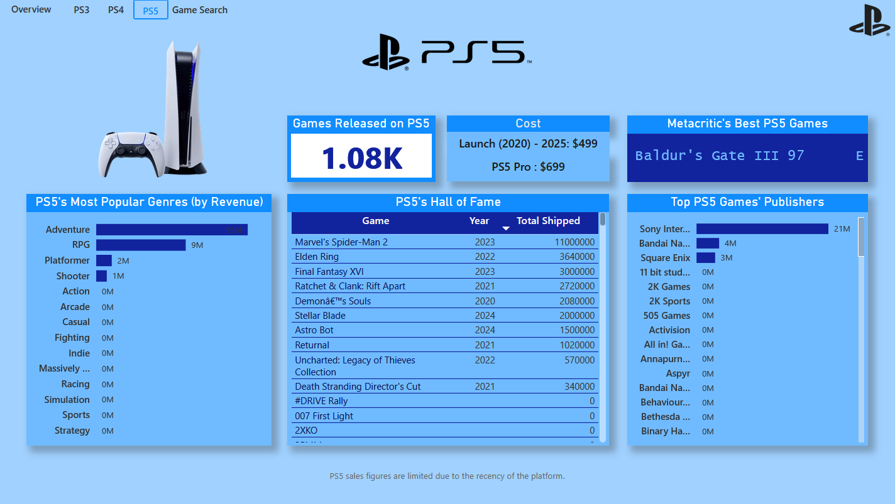
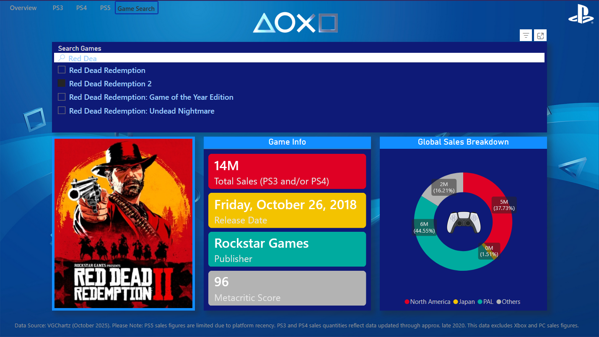

  

# 🎮 PlayStation Multi-Gen Intelligence Hub
### Console Lifecycle & Game Sales Intelligence (PS3 • PS4 • PS5)

> A Multi-Generation Console Analytics Platform  
> Revenue, Genre Evolution, Publisher Power & Title-Level Intelligence

## 📌 Project Overview

**PlayStation Multi-Gen Intelligence Hub** is a comprehensive Power BI analytics project designed to analyze the commercial and strategic evolution of Sony’s PlayStation ecosystem across three generations:

- 🟦 PlayStation 3  
- 🟦 PlayStation 4  
- 🟦 PlayStation 5  

The dashboard integrates:

- Global game sales  
- Publisher dominance  
- Genre revenue evolution  
- Console lifecycle comparison  
- Metacritic performance insights  
- Regional sales distribution  
- Title-level drillthrough search  

The objective is to understand how console generations evolve commercially and how publishers, genres, and flagship titles shape platform success.

## 🎯 Problem Statement

The gaming industry operates in generational cycles.

Key strategic questions:

- How do PS3, PS4, and PS5 compare commercially?
- Which genres dominate each generation?
- Which publishers drive console success?
- How does title performance vary by region?
- What is the relationship between critical acclaim and sales?
- How does console lifecycle maturity affect total copies sold?

This project delivers structured lifecycle intelligence using interactive BI modeling.

## 📊 Dashboard Structure

### 🏠 Overview – Ecosystem Snapshot
- Total game copies sold
- Genre revenue distribution
- Publisher dominance ranking
- Console market share split
- PlayStation Studios global presence

### 🎮 PS3 Intelligence
- Games released
- Lifecycle cost comparison
- Hall of Fame (Top-selling titles)
- Top publishers
- Genre revenue mix
- Metacritic best performers

### 🎮 PS4 Intelligence
- Total titles released
- Revenue-heavy genres
- Publisher concentration
- Sales leaders
- Platform maturity impact

### 🎮 PS5 Intelligence
- Early lifecycle performance
- Top shipped titles
- Publisher concentration shift
- Genre dominance evolution
- Generational comparison

### 🔎 Game Search & Title Drillthrough
Interactive search module enabling:
- Title-level lookup
- Release date insights
- Publisher breakdown
- Metacritic score
- Regional sales distribution (NA, EU, JP, Others)

## 🧩 Data Modeling Approach

The dashboard follows a structured analytical model.

**Primary Fact Table**
- Game-level sales and metadata (PS3, PS4, PS5)

**Dimension Attributes**
- Console Generation
- Genre
- Publisher
- Release Year
- Region
- Title

The model supports:
- Cross-generation comparison
- Genre lifecycle analysis
- Publisher benchmarking
- Regional distribution analytics
- Drillthrough-based search experience

## ⚙️ Model Optimization Note

High-cardinality descriptive fields were streamlined to maintain efficient performance and reduce PBIX size.  
The model is optimized for responsiveness, cross-filtering, and scalable lifecycle analysis.

## 🛠 Tools & Technologies

- Power BI Desktop  
- Power Query (Data Cleaning & Transformation)  
- DAX (Lifecycle & Comparative Metrics)  
- Star Schema Modeling  
- Generational Segmentation Analytics  

## 📷 Dashboard Preview

### 🏠 Home

### 🕹 Overview

### 🎮 PlayStation 3 Dashboard

### 🎮 PlayStation 4 Dashboard

### 🎮 PlayStation 5 Dashboard

### 🔎 Game Search

## 📂 Data Source

**PlayStation Sales & Metadata (PS3/PS4/PS5)**  
Source: Kaggle  
https://www.kaggle.com/datasets/gvidalguiresse/playstation-sales-and-metadata-ps3ps4ps5  

> ⚠️ Raw dataset is not redistributed in this repository due to Kaggle licensing restrictions.  
> Please download directly from the official Kaggle link.

## 📈 Key Insights

- PS4 represents the most commercially dominant lifecycle generation.
- Shooter and Action genres consistently dominate revenue.
- Publisher concentration remains high across generations.
- PS5 lifecycle data reflects early-stage growth dynamics.
- High Metacritic scores do not always guarantee highest sales.
- Regional distribution shows strong North America and Europe dominance.

## 💡 Business Value

This dashboard supports:

- Console lifecycle evaluation  
- Publisher market power analysis  
- Genre evolution tracking  
- Regional sales intelligence  
- Gaming industry investment analysis  

## 👤 Author

**Aryan Deshpande**  
> Aspiring Data Analyst
